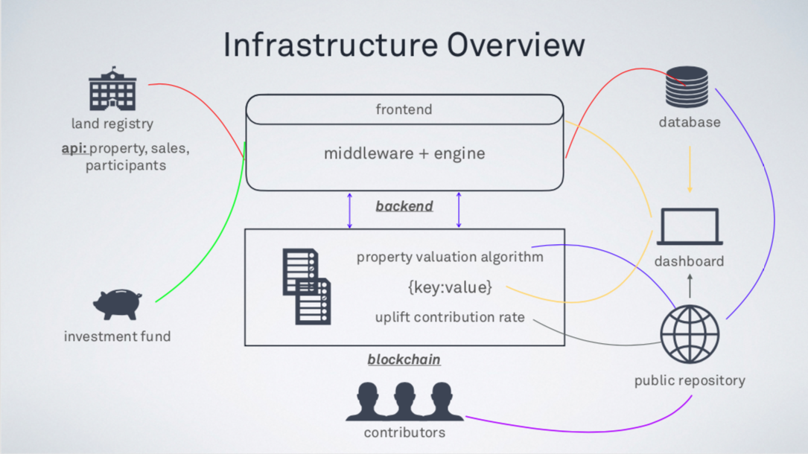

## Smart Commons Solidity (ETH) Prototype

### Infrastructure Overview

### Definition of the components
* **land registry:** First source of Input. Property, Sales and Participants data will be fetched from Land Registry's API or from an endpoint they provide where they push such data regularly.
* **investment fund:** That's a placeholder where equities from value uplift is collected. 
* **public repostory:** A public code repository that possibly hosted on Github or Gitlab, that holds the versioned property valuation and uplift value calculation algorithms.
* **database:** A Relational database that holds records retrieved from Land Registry and versioned algorithms for further usage and monitoring.
* **dashboard:** Dashboard that will have public and private access to monitoring data from database and blockchain.
* **smart contract:** Blockchain that will hold the information of properties of the smart covenant, their property valuation and uplift rate and algorithms that were used for calculations with their timestamps.

### The Narrative
Property, Sales and Participants data of the members of a Covenant is fetched from the Land Registry by the Backend (application). Then this data is pushed to the Database regularly.
 
The backend application will have a listener component that checks this fetched information to see whether there is a Sales transaction by a participant of the Smart Covenant.
 
If there is such transaction, the Middleware (part of the backend) will fetch the latest version of Property Valuation Algorithm from the blockchain.
 
Backend will run this algorithm for the property of the given Sales transaction. i.e Let's assume that a property is sold for 500k £, the algorithm computes that 200k £ is an uplift value and the agreed Uplift Contribution Rate is 10%. That means 20k £ of that amount will be transferred to Investment Fund automatically.
 
For the sake of reducing gas usage and simplicity, only the hash will be stored in blockchain, which will point to the latest version of the valuation algorithm in the public repository.
 
Valuation algorithm will be versioned and hosted in an open-source repository. Therefore any contributors will be able to develop and push their improvements to the valuation algorithm.
 
Sales, Participant and Property data, their current values and uplift values will be monitored from the dashboard.
 
### Installation.
First of all, download & install [Ganache](https://www.trufflesuite.com/ganachehttps://www.trufflesuite.com/ganache) 
 

Then clone the project to your computer.
 

`$ git clone git@github.com:lucidmindsai/smart-commons.git`
 

Navigate to the project's root folder.
 

`$ cd smart-commons`
 

Install all the project dependencies. Before that make sure you have `npm` installed in your computer. If not check [NPM Website](https://www.npmjs.com/https://www.npmjs.com/) for installation guideline.
 

If `npm` is in place, install all the dependencies: 
`$ npm install`
 

### __Attention.__
> Please note that all configuration to your local Ganache blockchain i.e., `127.0.0.1:7545` is already configured. On the other hand the default file structure of this Truffle project is changed: Smart contract files are moved under `/src` directory so the ***React App*** can reach them easily.

Now compile the whole project: 
`$ truffle compile`
 

Run the migrations: 

`$ truffle migration`
 

  > This is very similar to running migration on standart databases. But keep in mind that __blockchain is immutable__.

To test if everything is in place, let's do a quick try on the truffle console: 

`$ truffle console`
 

Then get a copy of the Smart Contract:
 

`truffle(development)> smartcommons = await SmartCommons.deployed()`
 

Retrieve the address of the contract:
 

`> smartcommons.address`
 

Get the name of the contract (check the constructor)
 

`name = await smartcommons.name()`
 

This will return `undefined`. Type `name` to see the result on the console.

Last but not least, run the whole test suite:
`$ truffle test`

 

If you ran into any problem(s), feel free to poke `@Oz` on Slack or reach him at `oguzhan@lucidminds.ai`.

